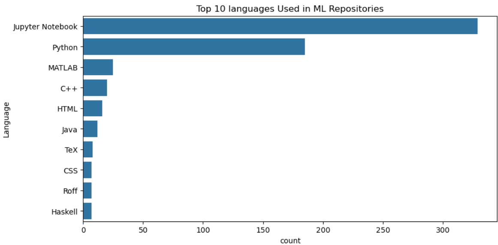
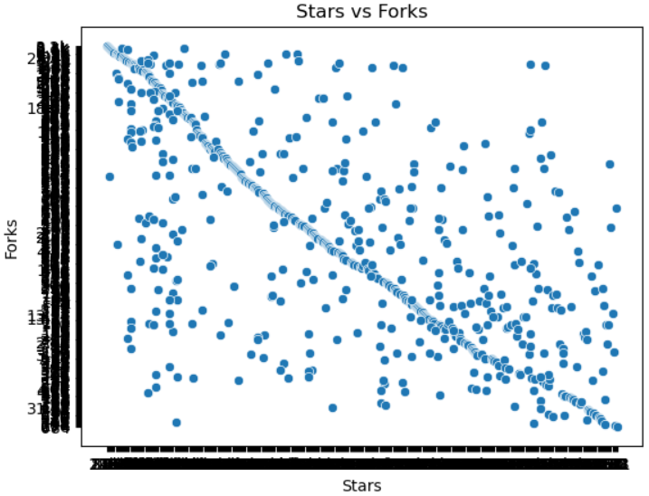
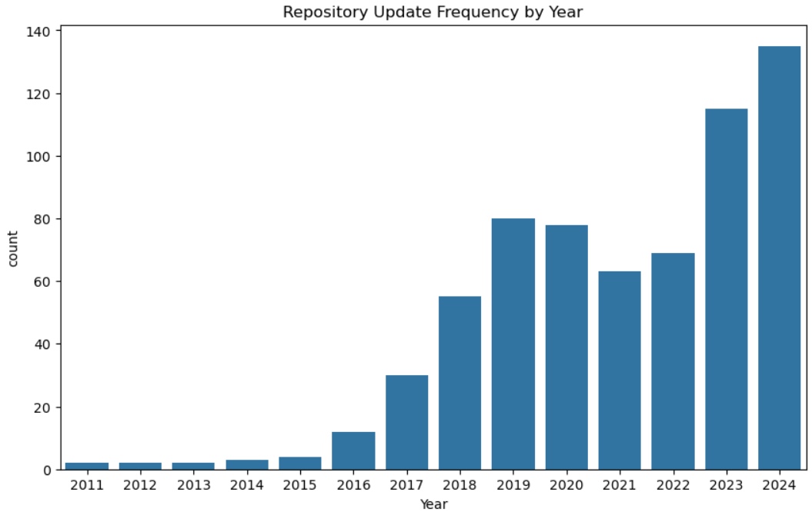

# 🧠 GitHub Machine Learning Repositories — Web Scraping & EDA

## 📘 Overview
This project involves **web scraping** data from **GitHub** to collect information about repositories related to **Machine Learning**.  
After gathering the data, **Exploratory Data Analysis (EDA)** is performed to uncover useful insights and trends about popular programming languages, repository popularity, and activity patterns.

---

## 🧰 Tools & Technologies Used
### 🔹 Web Scraping
- **Python**
- **Selenium (WebDriver)** — for automated browsing and scraping dynamic data from GitHub repository cards and pages.
- **WebDriverManager** — to manage ChromeDriver automatically.

### 🔹 Data Analysis & Visualization
- **Pandas** — for data cleaning and manipulation.
- **Matplotlib** & **Seaborn** — for visualizing data insights.
- **Jupyter Notebook** — to perform EDA interactively.

---

## 📂 Dataset Description
The dataset was **collected through web scraping** from GitHub using Selenium.  
Repositories were searched using the keyword **"Machine Learning"**, covering around 100 pages of search results.  
Each repository card was scraped for key information, while the *fork count* was extracted from the repository’s individual page.

| Column Name | Description |
|--------------|--------------|
| `Repo_Name` | Repository name |
| `Author_Name` | Owner of the repository |
| `Description` | Short summary of the project |
| `Language` | Primary programming language used |
| `Stars` | Number of stars on the repository |
| `Forks` | Number of forks |
| `Last_Updated` | When the repository was last updated |
| `URL` | Link to the repository |

The data was then saved into a **CSV file** using **Pandas**.

---

## 🔍 Data Collection Process
1. Opened GitHub’s repository search results for the query:  
   👉 `https://github.com/search?q=machine+learning&type=repositories&p=1`
2. Extracted data from repository cards such as:
   - Repository name
   - Author name
   - Description
   - Stars
   - Language
   - Last updated info
3. Navigated inside each repository to fetch **fork count** (since it’s not visible on the card view).
4. Repeated the process for 100 pages (with delays to prevent GitHub rate limits).
5. Stored data in `machine_learning_repos.csv`.

---

## 📊 Exploratory Data Analysis (EDA)
The scraped dataset was analyzed to explore the following insights:


### 1️⃣ Top Programming Languages in Machine Learning Repositories
A bar chart was used to visualize which programming languages are most frequently used in ML-related projects.!



### 2️⃣ Top 10 Most Starred Repositories
Identified the most popular repositories based on star counts.

[2.png](snaps/2.png)

### 3️⃣ Relationship Between Stars and Forks
A scatter plot was used to analyze whether highly starred repositories also tend to have more forks.



### 4️⃣ Repository Update Trends
Visualized how frequently machine learning repositories are updated (year-wise or recently).



---

## 📈 Key Insights
- **Python** emerged as the dominant language among machine learning repositories.
- Repositories with **high star counts** also generally have **high fork counts**, indicating popularity.
- Many repositories were updated recently, showing continuous contributions in ML projects.

---

## ⚙️ How to Run the Project
### 1️⃣ Install Dependencies
```bash
pip install pandas selenium matplotlib seaborn webdriver-manager

Use the provided notebook to scrape data

github_repos_scraper.ipynb

Run EDA Notebook

eda_github.ipynb

Folder Structure

📁 web-scraping-github/
│
├── github_repos_scraper.ipynb      # Web scraping script
├── eda_github.ipynb                # Exploratory Data Analysis
├── github_data.csv                 # Scraped dataset
└── README.md                       # Project documentation

Author

Muhammad Waqas

waqasowais548@gmail.com

Web Scraping & Data Analysis using Python

GitHub Repositories Data Analytics Project

Note

This dataset is for educational and research purposes only.
Please review GitHub’s Terms of Service
 before large-scale scraping.

